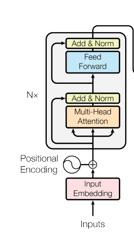

```angular2html
nn.TransformerEncoderLayer(d_model=80, dim_feedforward=256, nhead=2,batch_first=True)
"""
d_model-输入中预期特征的数量(必需)。
nhead-多头注意力模型中的头数(必需)。
dim_feedforward-前馈网络模型的维度(默认=2048)。
dropout-辍学值(默认= 0.1)。
activation-中间层的激活函数，可以是字符串(“relu” or “gelu”)或一元可调用函数。默认值：relu
layer_norm_eps-层标准化组件中的 eps 值(默认值=1e-5)。
batch_first-如果 True ，则输入和输出张量提供为 (batch, seq, feature)。默认值：False。
norm_first-如果 True ，层范数分别在注意力和前馈操作之前完成。否则之后就完成了。默认值：False(之后)。
"""
```
