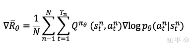

## PG
#### policygradient_reinforce.py
```
loss = -R =  -reward*log(p)
```


### AC:
loss = -R =  -Q(s,a)*log(p) 使用Q函数来代替R
#### Actor-Critic.py
```
loss = actor_loss + critic_loss
loss  =-Q*log(p) + loss_func(value,R) = =-(sum_r-v)*log(p) + loss_func(value,R)
```
#### actor 

#### critic


### A2C
#### A2C.py
#### actor 


```
advantage = A = Q-V = r+v_next-v=td error=sum(reward+0.95*v_next*(1-done)) - values
#pg：-reward*log(p) 
actor_loss  = -advantage * log(p) 
```
#### critic
```
critic_loss = advantage.pow(2).mean()
```
#### loss
```
loss=actor_loss + 0.5 * critic_loss - 0.001 * entropy
```
### 参考url
```
https://zhuanlan.zhihu.com/p/51645768

https://towardsdatascience.com/understanding-actor-critic-methods-931b97b6df3f
```

